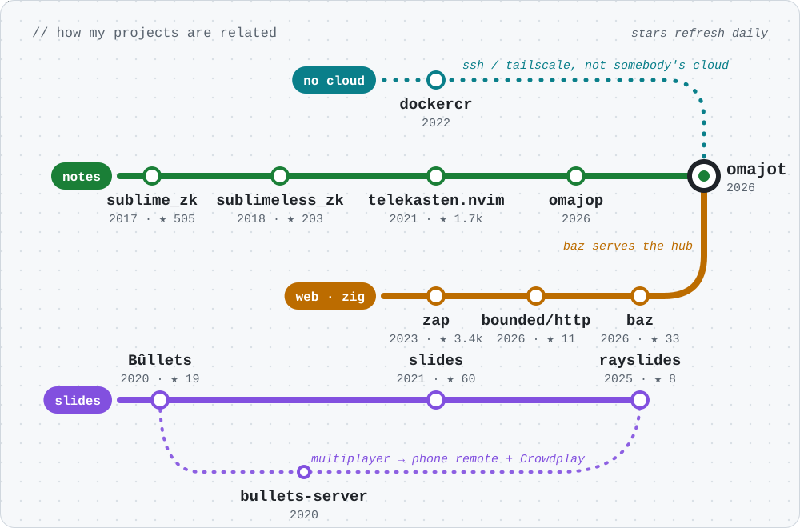
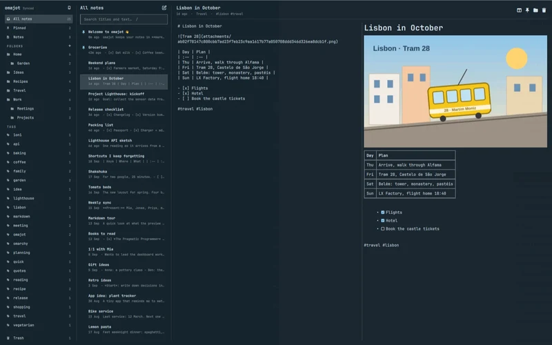
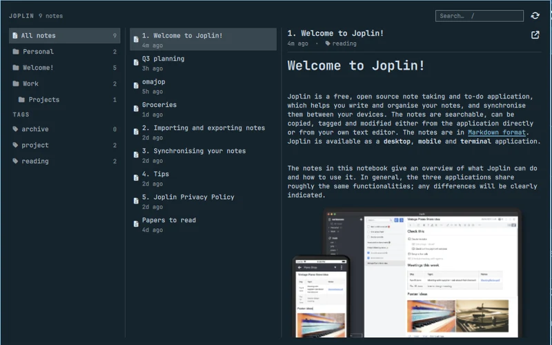
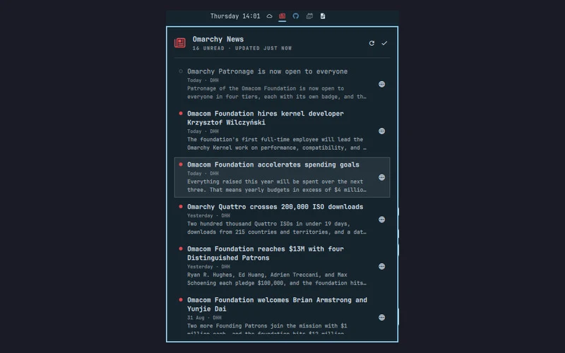
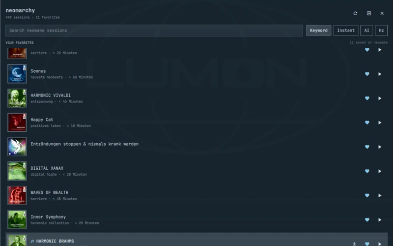

<picture>
  <source media="(prefers-color-scheme: dark)" srcset="assets/hero-dark.svg">
  
</picture>

<p align="center">
  <a href="https://renerocks.ai"></a>
  <a href="https://x.com/renerocksai"></a>
  <a href="https://www.linkedin.com/in/rene-schallner/"></a>
  <a href="https://github.com/sponsors/renerocksai"></a>
</p>

Most of my projects start with a question: **can I do _this_ without _that_?**
I build the thing, use it for real, and write down the verdict. The good ones
grow up and get a successor. So my repos aren't a list. They're a family tree:

<picture>
  <source media="(prefers-color-scheme: dark)" srcset="assets/map-dark.svg">
  
</picture>

- 🟢 **Notes:** [sublime_zk](https://github.com/renerocksai/sublime_zk) → [sublimeless_zk](https://github.com/renerocksai/sublimeless_zk) → [telekasten.nvim](https://github.com/nvim-telekasten/telekasten.nvim) → [omajop](https://github.com/renerocksai/omajop) → [omajot](https://github.com/renerocksai/omajot). Zettelkasten tools since 2017, one editor at a time.
- 🟠 **Web, in Zig:** [zap](https://github.com/zigzap/zap) → [bounded/http](https://github.com/technologylab-ai/bounded-http) → [baz](https://github.com/technologylab-ai/baz). From a C foundation to pure Zig with hard limits.
- 🟣 **Slides:** [Bûllets](https://github.com/renerocksai/bullets) → [slides](https://github.com/renerocksai/slides) → [rayslides](https://github.com/technologylab-ai/rayslides). Plain text in, great talk out. Third attempt, best one.
- 🔵 **No cloud:** [dockercr](https://github.com/renerocksai/dockercr) → [omajot](https://github.com/renerocksai/omajot). If SSH or Tailscale can do the job, I don't need somebody's cloud.

**omajot is where the lines meet:** notes from the green line, a hub served by
baz from the orange one, and the no-cloud rule from the blue one.

## 🖥️ Omarchy

<picture>
  <source media="(prefers-color-scheme: dark)" srcset="assets/omarchy-dark.svg">
  
</picture>

[Omarchy](https://omarchy.org) is my desktop. When I miss something in the bar,
I write a plugin for it. There are four so far, and each one installs with a
single command.

<table>
<tr>
<td width="50%" valign="top">
<a href="https://github.com/renerocksai/omajot"></a>
<b><a href="https://github.com/renerocksai/omajot">omajot</a></b>: my own notes app, synced by my own hub. A dropdown and a main window in the bar, full keyboard control, and the same notes in the terminal and on my phone.
</td>
<td width="50%" valign="top">
<a href="https://github.com/renerocksai/omajop"></a>
<b><a href="https://github.com/renerocksai/omajop">omajop</a></b>: a Joplin notes browser. Folders and tags, the note list and the rendered note, one click away. omajot's predecessor. When you're ready to move, omajot imports Joplin in one command.
</td>
</tr>
<tr>
<td width="50%" valign="top">
<a href="https://github.com/renerocksai/omapress"></a>
<b><a href="https://github.com/renerocksai/omapress">omapress</a></b>: Omarchy news in the bar. The newspaper turns red when there are unread posts, and a keyboard-driven panel reads them without a browser. Works offline.
</td>
<td width="50%" valign="top">
<a href="https://github.com/renerocksai/neomarchy"></a>
<b><a href="https://github.com/renerocksai/neomarchy">neomarchy</a></b>: search, favorite and play <a href="https://app.neowake.de/">neowake</a> sessions from the bar. Playback runs through mpv with MPRIS, so the media keys just work.
</td>
</tr>
</table>

```sh
omarchy plugin add https://github.com/renerocksai/omajot --enable
omarchy plugin add https://github.com/renerocksai/omajop --enable
omarchy plugin add https://github.com/renerocksai/omapress --enable
omarchy plugin add https://github.com/renerocksai/neomarchy --enable
```

omajot also needs its hub on an always-on machine: see
[Get started](https://renerocks.ai/omajot/get-started.html).

## 🧪 Case studies

The question, the trade, the verdict.

### [omajot](https://github.com/renerocksai/omajot): synced notes with no cloud at all?

Apple-Notes-like markdown notes in the Omarchy bar, in the terminal, and on my
iPhone. No Dropbox: a small Zig hub syncs every device over Tailscale. The hub
runs on my always-on M3 Max, the same box my coding agents already live on.
Hub-and-spoke is a pattern I trust, so notes got the same treatment. A CRDT
written in Zig merges concurrent edits, and the same Zig core runs natively on
the desktop and as `core.wasm` in the phone's web app. The hub is a
[baz](https://github.com/technologylab-ai/baz) app.

**Trade:** Dropbox's zero-setup sync, for notes that never leave my own
machines, work offline, never conflict, and that agents can script.<br>
**Verdict:** ✅ **Daily driver.** My notes live there now.

### [dockercr](https://github.com/renerocksai/dockercr): a container registry with nothing but SSH?

omajot's older sibling in spirit. ghcr.io has download limits. A self-hosted
registry wants TLS, a CA and access tokens. dockercr skips all of it: the
registry only listens on loopback, and SSH port forwarding does the
authentication and the encryption. No Docker Hub, no certificates.

**Verdict:** ✅ Push to production like a boss.

### [bounded/http](https://github.com/technologylab-ai/bounded-http) + [baz](https://github.com/technologylab-ai/baz): fast, *and* never past its limits?

[Zap](https://github.com/zigzap/zap) (★ 3.4k) made Zig backends blazingly fast
on top of facil.io, a C library. bounded/http replaces that foundation with
pure Zig on `io_uring`, `kqueue` and IOCP, inspired by
[TigerStyle](https://tigerstyle.dev): connections, buffers, queues and workers
are reserved up front. When capacity runs out, it pushes back instead of
growing. On Linux it needs no libc, so a server can be one static binary. Baz
(*Bounded Async Zap*) puts Zap's typed endpoints on top, with streaming, SSE,
Mustache templates and cookies.

**Verdict:** ✅ Good enough to trust with my notes: it runs the omajot hub.

### [rrisc](https://github.com/renerocksai/rrisc): can I build the CPU I drew in the nineties?

In the early nineties I designed a small *Radical RISC* CPU on paper. At
Christmas 2020 I finally built it: VHDL, simulated with ghdl and gtkwave from
vim and tmux, with its own assembler, running on a Xilinx Spartan-7 FPGA board.
[The whole story](https://renerocksai.github.io/rrisc) is written up, from
microcode sketches to the first executed instruction.

**Verdict:** ✅ Nearly thirty years late, and it runs.

### [rayslides](https://github.com/technologylab-ai/rayslides): can slides stay plain text and still not suck?

My third answer to the same question.
[Bûllets](https://github.com/renerocksai/bullets) (2020) turned the Godot game
engine into a slide show: interactive animations, a game in your deck, and a
multiplayer mode through
[bullets-server](https://github.com/renerocksai/bullets-server).
[slides](https://github.com/renerocksai/slides) (2021, my first Zig project)
went small: one executable, Dear ImGui and OpenGL, a markdown-ish text format,
at 10 000 FPS. rayslides, built on raylib, keeps the readable source and adds a
visual Studio that stays in sync with it, reveals, transitions and morph
animations, and an embedded Neovim. Bûllets' multiplayer grew up, too: it's now
a phone remote with speaker notes, plus Crowdplay audience polls.

**Verdict:** ✅ Nobody has noticed I'm not using PowerPoint.

### [tigerfans](https://github.com/renerocksai/tigerfans): can a database built for money sell conference tickets?

A ticket booking system on [TigerBeetle](https://tigerbeetle.com). Tickets and
goodies are accounts and transfers. A checkout places a time-limited hold, a
pending transfer, and the payment webhook either finalizes or voids it. It uses
FastAPI, Redis and PostgreSQL, has load tests, and I wrote an auto-batcher for
the async TigerBeetle client along the way. [Try it live](https://tigerfans.io).

**Verdict:** ✅ If you can reserve it or run out of it, TigerBeetle can count it.

<details>
<summary><b>📦 More experiments</b></summary>
<br>

| Project | What it is |
| --- | --- |
| [gpt4all.zig](https://github.com/renerocksai/gpt4all.zig) | A Zig build of a terminal chat client for a local LLM |
| [rj2obs](https://github.com/renerocksai/rj2obs) | Roam Research JSON to Obsidian markdown, keeping block references |
| [real-prog-qwerty](https://github.com/renerocksai/real-prog-qwerty) | A real programmer's QWERTY keyboard layout |
| [zigllmwiki](https://github.com/technologylab-ai/zigllmwiki) | An agent-first knowledge base for Zig 0.16 systems programming |
| [work-graph](https://github.com/technologylab-ai/work-graph) | GitHub-backed orientation and checkpoints for coding agents |
| [aercbook](https://github.com/renerocksai/aercbook) | An address book for the aerc mail client, in Zig |
| [0xeefe](https://github.com/renerocksai/0xeefe) | Easy encryption for everyone |
| [pdfshrink](https://github.com/technologylab-ai/pdfshrink) | Makes scanned PDFs much smaller, with readable text |

</details>

<p align="center"><sub>⚡ zig ⚡ &nbsp;·&nbsp; Vienna &nbsp;·&nbsp; <a href="https://renerocks.ai">renerocks.ai</a></sub></p>
